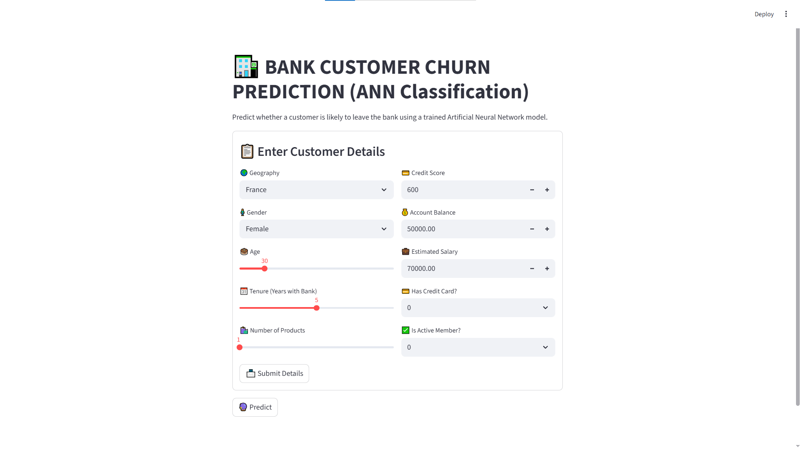
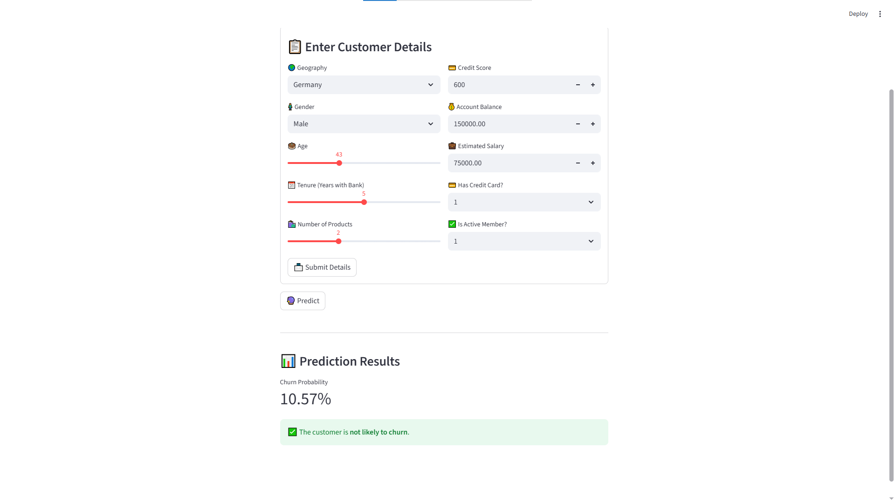

<h1 align="center">🏦 BANK CUSTOMER CHURN PREDICTION (ANN Classification)</h1>

  
  
  
  

---

<h2>📘 Project Overview</h2>

This project focuses on predicting whether a bank customer is likely to <strong>churn (leave the bank)</strong> using a trained <strong>Artificial Neural Network (ANN)</strong>.  
The app is built with <strong>Streamlit</strong> to provide an interactive web-based experience for business users and data analysts.  
Users can input customer details such as <em>credit score, age, balance, tenure, products, and activity level</em> to instantly see the predicted churn probability.

---

<h2>🎯 Key Features</h2>

<ul>
  <li>⚡ <strong>Real-time churn prediction</strong> using a deep learning ANN model</li>
  <li>📊 <strong>Streamlit UI</strong> for user-friendly interaction and live model inference</li>
  <li>🧠 <strong>Scalable data preprocessing</strong> with OneHotEncoder, LabelEncoder, and StandardScaler</li>
  <li>📈 <strong>Probability-based output</strong> with visual indicators (success/error styling)</li>
  <li>💾 Model and encoder files are loaded dynamically from pickle and Keras formats</li>
</ul>

---

<h2>🧩 Tech Stack</h2>

<table>
<tr>
  <td><strong>Language</strong></td>
  <td>Python 🐍</td>
</tr>
<tr>
  <td><strong>Framework</strong></td>
  <td>TensorFlow / Keras</td>
</tr>
<tr>
  <td><strong>Frontend</strong></td>
  <td>Streamlit</td>
</tr>
<tr>
  <td><strong>Data Preprocessing</strong></td>
  <td>scikit-learn (StandardScaler, LabelEncoder, OneHotEncoder)</td>
</tr>
<tr>
  <td><strong>Model Type</strong></td>
  <td>Artificial Neural Network (Classification)</td>
</tr>
</table>

---

<h2>🧠 Skills Demonstrated</h2>

<ul>
  <li>Machine Learning Model Development</li>
  <li>Deep Learning with TensorFlow & Keras</li>
  <li>Feature Engineering & Data Encoding</li>
  <li>Model Deployment with Streamlit</li>
  <li>Version Control & GitHub Collaboration</li>
</ul>

---

---

<h2 align="center">🖥️ Application Interface</h2>

  
  

---

<h2 align="center">📊 Model Insights & Graphs</h2>

  
  

---

<h2>🚀 How to Run the Project</h2>

<ol>
  <li>Clone the repository:
    <pre><code>git clone https://github.com/yourusername/Bank-Customer-Churn-Prediction.git</code></pre>
  </li>
  <li>Create a virtual environment and activate it:
    <pre><code>python -m venv venv
venv\\Scripts\\activate</code></pre>
  </li>
  <li>Install dependencies:
    <pre><code>pip install -r requirements.txt</code></pre>
  </li>
  <li>Run the Streamlit app:
    <pre><code>streamlit run app.py</code></pre>
  </li>
</ol>

---

<h2>📂 Folder Structure</h2>

<pre>
📁 Bank-Customer-Churn-Prediction
│
├── app.py                        # Main Streamlit application
├── model.h5                      # Trained ANN model
├── scaler.pkl                    # StandardScaler object
├── label_encoder_gender.pkl      # LabelEncoder for Gender
├── onehot_encoder_geo.pkl        # OneHotEncoder for Geography
├── requirements.txt              # Dependencies
└── README.md                     # Project documentation
</pre>

---

<h2>🤝 Collaboration</h2>

This project is open for contributions!  
If you'd like to improve the model, UI, or add new features:

<ol>
  <li>Fork the repository 🍴</li>
  <li>Create a new branch (<code>feature/your-feature</code>)</li>
  <li>Commit your changes with clear messages</li>
  <li>Open a Pull Request 🚀</li>
</ol>

  

---

<h2>💡 Future Enhancements</h2>

<ul>
  <li>📱 Integrate dashboard visualizations using Plotly or Altair</li>
  <li>☁️ Deploy the app on Streamlit Cloud or Hugging Face Spaces</li>
  <li>🔒 Add user authentication for secure access</li>
</ul>

---

<h2>🙏 Acknowledgements</h2>

Special thanks to:
<ul>
  <li>❤️ <strong>Krish Naik Sir</strong> for mentoring and guiding such beautiful project</li>
  <li>📘 <strong>Scikit-learn</strong> for preprocessing utilities</li>
  <li>🧠 <strong>TensorFlow/Keras</strong> for model training</li>
  <li>🚀 <strong>Streamlit</strong> for an elegant front-end framework</li>
  <li>💡 Community contributors and open datasets for enabling reproducible ML</li>
</ul>

---

<h3 align="center">⭐ If you like this project, give it a star on GitHub! ⭐</h3>

Made with ❤️ using Streamlit & TensorFlow

